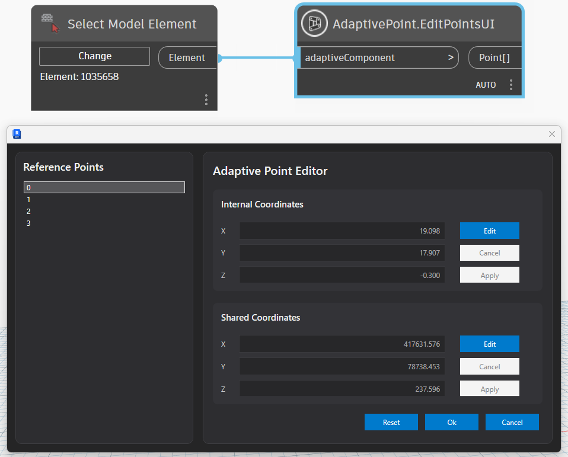

# AdaptivePoints

A Revit + Dynamo extension for managing **Adaptive Component placement points** with full support for:
- Internal and Shared coordinates
- WPF-based point editor UI
- Multi-version Revit support (2023–2026)
- Clean service-oriented architecture
- Dynamo nodes for automation and UI editing

---

## 🚀 Features

- 📍 Read Adaptive Component reference points
- 🔄 Convert between Internal and Shared coordinates
- ✏️ Edit points using a WPF UI editor
- 🧠 MVVM-based architecture (optional UI layer)
- 🔧 Safe Revit transaction handling
- 🔌 Dynamo nodes for automation workflows
- 🏗️ Multi-Revit version support:
  - Revit 2023 (NET48)
  - Revit 2024 (NET48)
  - Revit 2025 (NET8)
  - Revit 2026 (NET8)

---

## 🖼️ Screenshots

> 

## 🧠 Architecture Overview

The project follows a layered architecture:

- **Core**
  - Pure models and validation logic
- **Revit Layer**
  - Handles Revit API interaction
  - Manages transactions safely
- **UI Layer**
  - WPF editor for interactive point editing
- **Dynamo Nodes**
  - Entry points for Dynamo users

---

## 🧩 Key Concepts

### AdaptivePointEntity
Represents a single adaptive point:

- Index
- Name
- InternalPoint (Revit coordinate system)
- SharedPoint (Project coordinate system)

---

### Coordinate Transformation

Supports bidirectional conversion:

- Internal → Shared
- Shared → Internal

Used for consistent modeling across Revit project coordinates.

---

## 🖥️ UI Editor

The WPF editor allows:

- Selecting reference points
- Editing Internal coordinates
- Editing Shared coordinates
- Auto-sync between coordinate systems
- Applying changes back to Revit

---

## ⚙️ Installation

1. Build solution in **Release**
2. Copy output DLL to Dynamo or Revit Add-ins folder:
   ```
   %AppData%\Autodesk\Revit\Addins\20XX\
   ```
3. Load Dynamo and search for:
   ```
   AdaptivePoints
   ```

---

## 🧪 Example Usage (Dynamo)

### Get Points
```csharp
AdaptivePoint.GetPoints(adaptiveComponent);
AdaptivePoint.UpdatePoints(adaptiveComponent, points);
AdaptivePoint.EditPointsUI(adaptiveComponent);
```

## 🔥 Supported Revit Versions

| Version | Runtime            |
| ------- | ------------------ |
| 2023    | .NET Framework 4.8 |
| 2024    | .NET Framework 4.8 |
| 2025    | .NET 8             |
| 2026    | .NET 8             |

## 🛠️ Technologies
- Autodesk Revit API
- Dynamo API
- WPF (UI layer)
- MVVM (optional)
- .NET 8 / .NET Framework 4.8
- C#

## 📌 Notes
- Transactions are handled via TransactionManager for Dynamo compatibility
- Internal Revit units are never rounded (UI only)
- Designed for adaptive components only

## 📈 Future Improvements
- Grasshopper compatibility layer
- Point snapping & constraints
- Live preview in UI
- Version diffing of adaptive point sets
- Geometry-based adaptive mapping

## 👤 Author

Built by Atul Tegar

Focus: BIM automation, Revit API, Dynamo, and computational design workflows